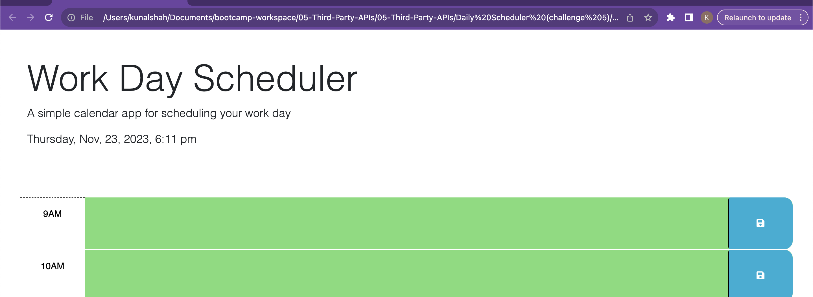

# Work Day Scheduler Starter Code

- Goals of the code: -- fully implement a daily scheduler where the user can add in their items per hour for their workday, save their changes

- Use: To use, click into the desired hour you would like you update, add in your comments, to do list, or what information is needed, and hit the save icon. 

- Configuration: please access the site using this URL: 

- Troubleshooting: * unable to get the colors for the past present and future to line up correctly. also, when refreshing the page, the local storage is reset and the items do not appear on the reloaded page. 

- screenshot

- Licensing: We used open source third party APIs in order to create this website. 
    - jquery, dayjs, google fonts. 